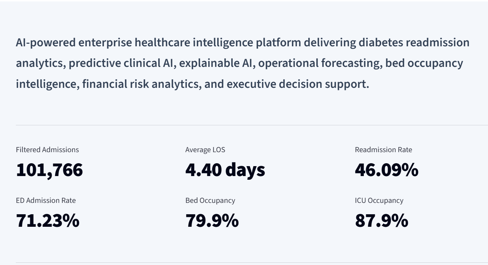
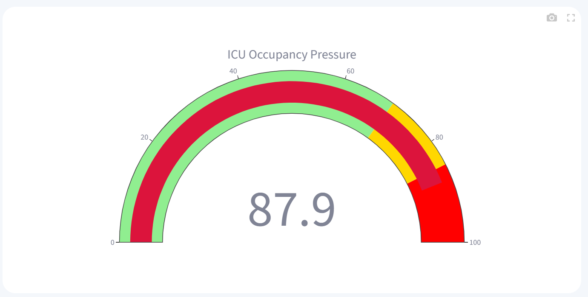
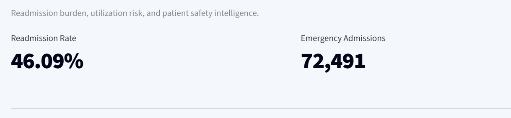
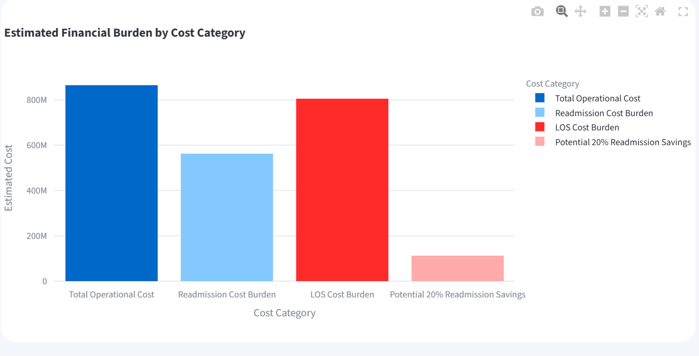
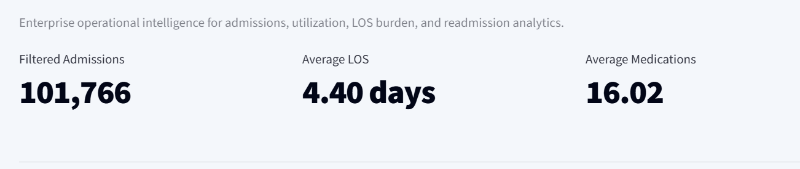

<<<<<<< HEAD

=======
# 🏥 DiaIntel AI 

---

# 🌍 Live Executive Healthcare AI Platform

## 🔗 Live Demo
[Launch DiaIntel AI](https://https://healthcare-executive-intelligence-platform-h7a9etjs67ogqjjne3r.streamlit.app/)

---

## 💻 GitHub Repository
[View Source Code](https://github.com/drsam-israel/
Healthcare-Executive-Intelligence-AI-Platform)

---
## Enterprise Diabetes Readmission Intelligence & Predictive Healthcare AI Platform

An enterprise-grade Healthcare AI platform designed for executive healthcare intelligence, diabetes readmission analytics, operational forecasting, explainable AI, financial risk analytics, and predictive clinical decision support.

---

# 🚀 Platform Overview

DiaIntel AI is a production-style healthcare intelligence platform developed using:

- Python
- Streamlit
- Machine Learning
- Explainable AI
- Predictive Analytics
- Operational Intelligence
- Healthcare Forecasting
- Executive Dashboard Engineering

The platform simulates a real-world enterprise healthcare command center capable of supporting:

- hospital operations intelligence
- diabetes readmission surveillance
- executive KPI monitoring
- financial risk analytics
- ICU & bed occupancy forecasting
- explainable AI decision support
- predictive healthcare analytics

---

# 🌍 Enterprise Healthcare Intelligence Capabilities

## 📊 Executive Command Center
Executive-level operational healthcare intelligence dashboards including:

- total admissions analytics
- readmission surveillance
- ICU utilization monitoring
- ED utilization intelligence
- LOS optimization metrics
- enterprise healthcare KPIs

---

## 🧠 Predictive Clinical AI
Machine learning-powered diabetes readmission intelligence capable of:

- identifying high-risk patients
- supporting discharge planning
- improving care coordination
- enabling risk stratification workflows
- enhancing post-discharge intervention planning

---

## 🔍 Explainable AI Intelligence
Integrated Explainable AI (XAI) analytics using feature importance modeling to improve:

- AI transparency
- executive trust
- model interpretability
- healthcare AI governance
- clinical explainability

Key readmission drivers identified include:

- inpatient utilization frequency
- discharge disposition
- emergency utilization
- medication burden
- LOS duration
- diagnosis complexity

---

## 🛏️ Bed Occupancy Intelligence
Enterprise inpatient utilization analytics including:

- projected bed occupancy
- ICU capacity monitoring
- LOS intelligence
- inpatient throughput analytics
- operational capacity forecasting

---

## ⚠️ Quality & Risk Intelligence
Advanced healthcare quality surveillance supporting:

- readmission burden analysis
- mortality surveillance
- utilization risk intelligence
- patient safety analytics
- emergency admission monitoring

---

## 💰 Financial Performance Analytics
Healthcare financial intelligence dashboards supporting:

- operational cost analytics
- readmission financial burden
- LOS cost exposure
- enterprise utilization economics
- projected savings modeling

---

## 📈 Operational Forecasting
Predictive operational intelligence supporting:

- admissions forecasting
- ICU demand forecasting
- occupancy trend prediction
- capacity risk monitoring
- operational planning

---

# 🧮 Executive-Level Quantified Insights

- Total hospital admissions analyzed: **101,766**
- Enterprise readmission rate: **46.09%**
- Estimated ICU occupancy: **87.9%**
- Forecasted ICU occupancy projected to reach: **95.8%**
- Average LOS: **4.40 days**
- ED utilization exceeded: **71.23%**
- Estimated operational cost burden exceeded: **$865M**
- Readmission-related financial burden exceeded: **$562.8M**
- LOS-related operational burden exceeded: **$805.3M**
- Projected 20% readmission reduction savings: **$112.6M**

---

# 🏗️ Technology Stack

| Category | Technologies |
|---|---|
| Programming | Python |
| Dashboard Framework | Streamlit |
| Data Processing | Pandas, NumPy |
| Visualization | Plotly Express, Plotly Graph Objects |
| Machine Learning | Scikit-learn |
| Explainable AI | Feature Importance Modeling |
| Forecasting | Predictive Operational Analytics |
| UI Design | Custom Enterprise CSS |
| Deployment | Streamlit Cloud |

---

# 🧠 Machine Learning Components

The platform integrates predictive AI workflows for:

- diabetes readmission prediction
- operational forecasting
- utilization intelligence
- healthcare risk analytics
- explainable AI interpretation

---

# 🎨 Enterprise UI/UX Features

Production-style executive dashboard design including:

- premium healthcare dashboard UI
- enterprise navigation system
- modern healthcare analytics styling
- executive KPI cards
- responsive operational layouts
- dark enterprise sidebar
- interactive healthcare visualizations

---

# 📂 Project Structure

```bash
healthcare-executive-intelligence-platform/
│
├── app/
│   ├── dashboard.py
│   ├── auth.py
│   └── utils.py
│
├── data/
│   └── diabetes_data.csv
│
├── models/
│   └── readmission_model.pkl
│
├── screenshots/
│
├── requirements.txt
├── README.md
└── .gitignore
```

---

# 📸 Platform Screenshots

## Executive Command Center


## Bed Occupancy Intelligence


## Quality & Risk Intelligence


## Financial Performance Analytics


## Operational Forecasting


---

# 🚀 Deployment

## Run Locally

```bash
git clone https://github.com/YOUR_USERNAME/healthcare-executive-intelligence-platform.git

cd healthcare-executive-intelligence-platform

pip install -r requirements.txt

streamlit run app/dashboard.py
```

---

# 🌐 Streamlit Deployment

This platform is deployment-ready on:

- Streamlit Cloud
- Render
- Azure App Services
- AWS
- GCP

---

# 📊 Enterprise Healthcare Use Cases

This platform can support:

- hospital operations intelligence
- healthcare executive dashboards
- diabetes readmission reduction initiatives
- ICU capacity planning
- healthcare AI governance
- predictive healthcare analytics
- enterprise utilization intelligence
- healthcare financial optimization
- operational forecasting workflows

---

# 🏥 Strategic Executive Summary

DiaIntel AI demonstrates how enterprise Healthcare AI systems can combine:

- predictive analytics
- operational intelligence
- explainable AI
- financial analytics
- forecasting
- executive healthcare dashboards

to support modern healthcare transformation initiatives.

The platform simulates production-grade enterprise healthcare intelligence systems used for:

- utilization management
- operational planning
- clinical risk reduction
- executive reporting
- AI-assisted healthcare decision support

---

# 👨‍⚕️ Author

## Samuel Israel, MD

Healthcare AI | Clinical AI | Predictive Analytics | Explainable AI | Digital Health Transformation | Healthcare Intelligence Systems

---

# ⭐ Project Highlights

✅ Enterprise Healthcare AI Platform  
✅ Executive Healthcare Intelligence  
✅ Predictive Clinical AI  
✅ Explainable AI  
✅ Operational Forecasting  
✅ Financial Risk Analytics  
✅ ICU Capacity Intelligence  
✅ Streamlit Deployment  
✅ Executive Dashboard Engineering  
✅ Production-Style Healthcare Analytics
>>>>>>> c78ee57 (Updated production-grade README for DiaIntel AI platform)
